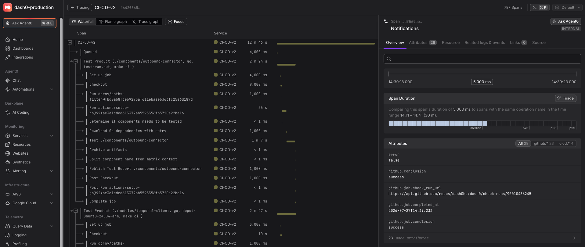

> **📢 This repository has moved.**
> Please update your workflows to use `dash0hq/otel-cicd-action@v4` instead of
> `corentinmusard/otel-cicd-action@v4`. Existing references continue to work via
> redirect, but updating is recommended. See the pinned Discussion for details.

# OpenTelemetry CI/CD Action

[![Unit Tests][ci-img]][ci]
![GitHub License][license-img]

This action exports Github CI/CD workflows to any endpoint compatible with OpenTelemetry.

This is a fork of [otel-export-trace-action](https://github.com/inception-health/otel-export-trace-action) with more features and better support.
Originally created and maintained by [Corentin Musard](https://github.com/corentinmusard), now maintained by [Dash0](https://www.dash0.com).

Compliant with OpenTelemetry [CICD semconv](https://opentelemetry.io/docs/specs/semconv/attributes-registry/cicd/).
Look at [Sample OpenTelemetry Output](./src/__assets__/output_success.txt) for the list of attributes and their values.



## Usage

We provide sample code for popular platforms. If you feel one is missing, please open an issue.

| Code Sample                 | File                                             |
| --------------------------- | ------------------------------------------------ |
| Inside an existing workflow | [build.yml](.github/workflows/build.yml)         |
| From a private repository   | [private.yml](.github/workflows/private.yml)     |
| Axiom                       | [axiom.yml](.github/workflows/axiom.yml)         |
| New Relic                   | [newrelic.yml](.github/workflows/newrelic.yml)   |
| Honeycomb                   | [honeycomb.yml](.github/workflows/honeycomb.yml) |
| Dash0                       | [dash0.yml](.github/workflows/dash0.yml)         |

### On workflow_run event

[workflow_run github documentation](<https://docs.github.com/en/actions/writing-workflows/choosing-when-your-workflow-runs/events-that-trigger-workflows#workflow_run>)

```yaml
on:
  workflow_run:
    workflows:
      # The name of the workflow(s) that triggers the export
      - "Build"
    types: [completed]

jobs:
  otel-cicd-actions:
    runs-on: ubuntu-latest
    steps:
      - uses: dash0hq/otel-cicd-action@v4
        with:
          otlpEndpoint: grpc://ingress.eu-west-1.aws.dash0.com:4317
          otlpHeaders: ${{ secrets.OTLP_HEADERS }}
          githubToken: ${{ secrets.GITHUB_TOKEN }}
          runId: ${{ github.event.workflow_run.id }}
```

### Inside an existing workflow

```yaml
jobs:
  build:
    # ... existing code
  otel-cicd-action:
    if: always()
    name: OpenTelemetry Export Trace
    runs-on: ubuntu-latest
    needs: [build] # must run when all jobs are completed
    steps:
      - name: Export workflow
        uses: dash0hq/otel-cicd-action@v4
        with:
          otlpEndpoint: grpc://ingress.eu-west-1.aws.dash0.com:4317
          otlpHeaders: ${{ secrets.OTLP_HEADERS }}
          githubToken: ${{ secrets.GITHUB_TOKEN }}
```

### `On workflow_run event` vs `Inside an existing workflow`

Both methods must be run when the workflow is completed, otherwise, the trace will be incomplete.

| Differences                                         | On workflow_run event | Inside an existing workflow |
| --------------------------------------------------- | --------------------- | --------------------------- |
| Shows in PR page                                    | No                    | Yes                         |
| Shows in Actions tab                                | Yes                   | Yes                         |
| Needs extra consideration to be run as the last job | No                    | Yes                         |
| Must be duplicated for multiple workflows           | No                    | Yes                         |

### Private Repository

If you are using a private repository, you need to set the following permissions in your workflow file.
It can be done at the global level or at the job level.

```yaml
permissions:
  contents: read # Required. To access the private repository
  actions: read # Required. To read workflow runs
  pull-requests: read # Optional. To read PR labels
  checks: read # Optional. To read run annotations
```

### Adding arbitrary resource attributes

You can use `extraAttributes` to set any additional string resource attributes.
Attributes are splitted on `,` and then each key/value are splitted on the first `=`.

```yaml
- name: Export workflow
  uses: dash0hq/otel-cicd-action@v4
  with:
    otlpEndpoint: "CHANGE ME"
    otlpHeaders: "CHANGE ME"
    githubToken: ${{ secrets.GITHUB_TOKEN }}
    extraAttributes: "extra.attribute=1,key2=value2"
```

### Using a self-signed certificate

When an internal OTLP endpoint uses a self-signed certificate and its certificate authority cannot
be added to the runner's trust store, set `otlpInsecureSkipVerify` to `true`:

```yaml
- name: Export workflow
  uses: dash0hq/otel-cicd-action@v4
  with:
    otlpEndpoint: grpc://otlp.example.com:4317
    otlpHeaders: "CHANGE ME"
    githubToken: ${{ secrets.GITHUB_TOKEN }}
    otlpInsecureSkipVerify: true
```

This disables certificate verification for the OTLP exporter connection and makes it vulnerable to
man-in-the-middle attacks. Only use it with a trusted internal endpoint.

### Action Inputs

| name                   | description                                                                                                              | required | default                               | example                                                           |
| ---------------------- | ------------------------------------------------------------------------------------------------------------------------ | -------- | ------------------------------------- | ----------------------------------------------------------------- |
| otlpEndpoint           | The destination endpoint to export OpenTelemetry traces to. It supports `https://`, `http://` and `grpc://` endpoints.   | true     |                                       | `https://ingress.eu-west-1.aws.dash0.com/v1/traces`               |
| otlpHeaders            | Headers to add to the OpenTelemetry exporter.                                                                            | true     |                                       | `Authorization=Bearer YOUR_AUTH_TOKEN,Dash0-Dataset=YOUR_DATASET` |
| otelServiceName        | OpenTelemetry service name                                                                                               | false    | `<The name of the exported workflow>` | `Build CI`                                                        |
| githubToken            | The repository token with Workflow permissions. Required for private repos                                               | false    |                                       | `${{ secrets.GITHUB_TOKEN }}`                                     |
| runId                  | Workflow Run ID to Export                                                                                                | false    | env.GITHUB_RUN_ID                     | `${{ github.event.workflow_run.id }}`                             |
| extraAttributes        | Extra resource attributes to add to each span                                                                            | false    |                                       | `extra.attribute=1,key2=value2`                                   |
| otlpInsecureSkipVerify | Disable TLS certificate verification for the OTLP exporter. Only use this with trusted endpoints.                        | false    | `false`                               | `true`                                                            |

### Action Outputs

| name    | description                                 |
| ------- | ------------------------------------------- |
| traceId | The OpenTelemetry Trace ID of the root span |

## Metrics Exported

In addition to distributed traces, this action exports the following OpenTelemetry metrics:

### `github.pull_request.lead_time`

- **Type:** Gauge
- **Unit:** Milliseconds (ms)
- **Description:** Lead time from first commit to workflow completion
- **Availability:** Only recorded for workflows triggered by pull requests with PR details available
- **PR Auto-detection:** For `push` events, PR numbers are automatically extracted from default merge commit messages to enable lead time calculation
- **Attributes:**
  - `repository.name` - Repository full name (e.g., `owner/repo`)
  - `pull_request.number` - Pull request number
  - `workflow.event` - Event that triggered the workflow

### `github.pull_request.lead_time.phase_duration`

- **Type:** Gauge
- **Unit:** Milliseconds (ms)
- **Description:** Lead time phase duration for pull requests
- **Availability:** Only recorded for workflows triggered by pull requests with PR details available
- **PR Auto-detection:** For `push` events, PR numbers are automatically extracted from default merge commit messages to enable lead time calculation
- **Attributes:**
  - `repository.name` - Repository full name (e.g., `owner/repo`)
  - `pull_request.number` - Pull request number
  - `workflow.event` - Event that triggered the workflow
  - `lead_time.phase` - Lead time phase name:
    - `first_commit_to_pr_created`
    - `pr_created_to_ready_for_review`
    - `ready_for_review_to_approved`
    - `approved_to_merged`
    - `merged_to_deployed`

## What data is exported

The action exports the workflow run metadata returned by the GitHub API as span attributes,
without redaction. There is currently no way to opt out of individual attributes, so make sure
your telemetry backend is an acceptable place for this data. In particular, be aware that:

- **Commit metadata** is included: the full commit message, plus author and committer
  names and email addresses (`github.head_commit.*`).
- **Job annotations and PR metadata** are included when the token has the optional
  `checks: read` and `pull-requests: read` permissions: annotation messages, PR numbers,
  branch names, and labels.
- **`service.instance.id` is unique per run attempt** (`<repo>/<workflow id>/<run id>/<attempt>`),
  so each workflow run appears as its own service instance. Backends that bill or aggregate
  by service instance will see one instance per run.

See the [Sample OpenTelemetry Output](./src/__assets__/output_success.txt) for the full list
of exported attributes and example values.

[ci-img]: https://github.com/dash0hq/otel-cicd-action/actions/workflows/build.yml/badge.svg?branch=main
[ci]: https://github.com/dash0hq/otel-cicd-action/actions/workflows/build.yml?query=branch%3Amain
[license-img]: https://img.shields.io/github/license/dash0hq/otel-cicd-action
